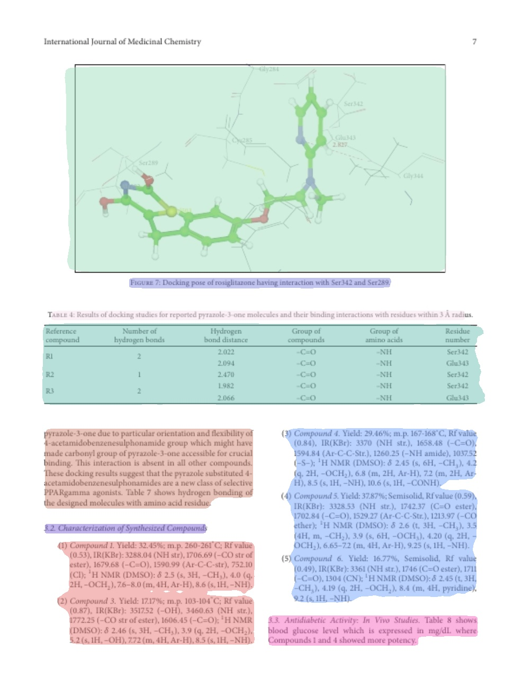
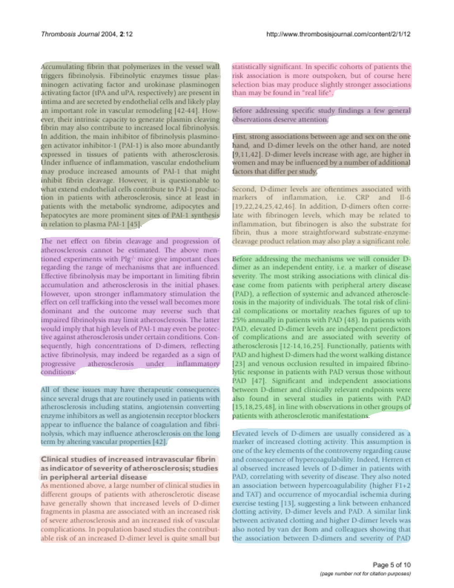

# PubLayNet

PubLayNet is a large dataset of document images, of which the layout is annotated with both bounding boxes and polygonal segmentations. The source of the documents is [PubMed Central Open Access Subset (commercial use collection)](https://www.ncbi.nlm.nih.gov/pmc/tools/openftlist/). The annotations are automatically generated by matching the PDF format and the XML format of the articles in the PubMed Central Open Access Subset. More details are available in our paper ["PubLayNet: largest dataset ever for document layout analysis."](https://arxiv.org/abs/1908.07836).

for more information, see [PubLayNet original](https://github.com/ibm-aur-nlp/PubLayNet)

## Recent updates 


`22/Feb/2020` - Pre-trained Mask-RCNN model in (Pytorch) are [released](maskrcnn) .


## Inference


Download trained weights here, locate it in [maskrcnn directory](maskrcnn)


- [12000x16 iterations](https://drive.google.com/open?id=1T2ciEJ7npW_aBpNrKHiUAluyk04K0AWK)


Run
```
python infer.py <path_to_image>
```


## Example Results

 |  
:-------------------------:|:-------------------------:
**PMC4334925_00006.jpg**  | **PMC538274_00004.jpg**


## Getting data

Images and annotations can be downloaded [here](https://developer.ibm.com/exchanges/data/all/publaynet/). The training set is quite large, so two options are offered. We split the training set into 7 batches, which can be separately downloaded. Or you can also download the full set at once.

If direct download in browser is unstable or you want to download the data from the command line, you can use curl or wget to download the data.

```
curl -o <YOUR_TARGET_DIR>/publaynet.tar.gz https://dax.cdn.appdomain.cloud/dax-publaynet/1.0.0/publaynet.tar.gz
```

```
wget -O <YOUR_TARGET_DIR>/publaynet.tar.gz https://dax.cdn.appdomain.cloud/dax-publaynet/1.0.0/publaynet.tar.gz
```

## Annotation format

The annotation files follows the [json format of the Object Detection task of MS COCO](http://cocodataset.org/#format-data)

## Examples

A [Jupyter notebook](./explore_PubLayNet_dataset.ipynb) is provided to generate the following visualization of the annotations of 20 sample pages.


